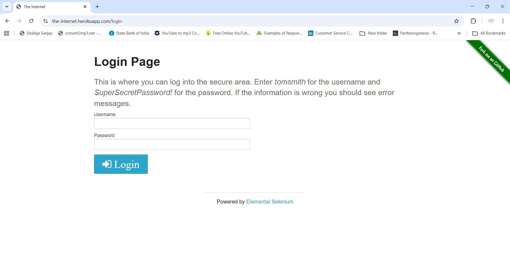
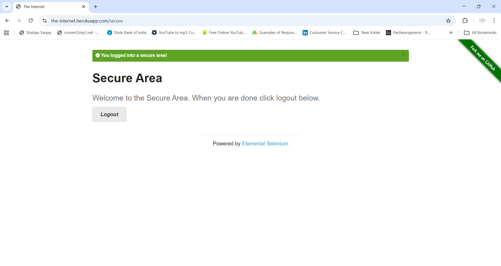
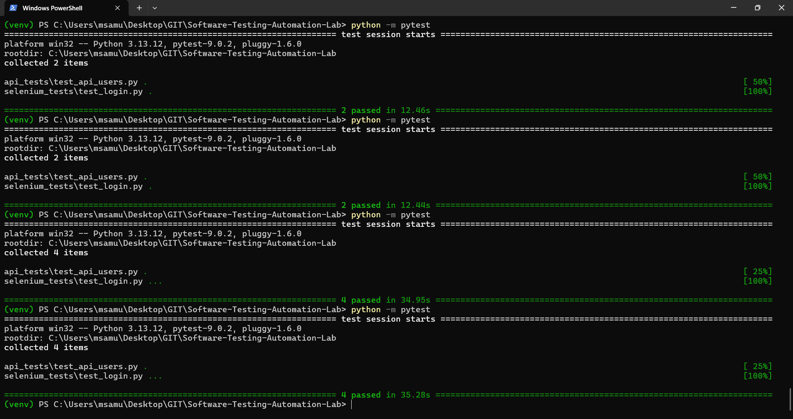

# Software Testing Automation Lab

This project demonstrates beginner-level software testing practices including UI automation, API testing, test case documentation, and bug reporting.

## Technologies Used
- Python
- Selenium WebDriver
- PyTest
- Requests (API Testing)

## Project Structure

software-testing-automation-lab
│
├── selenium_tests
│   └── test_login.py
│
├── api_tests
│   └── test_api_users.py
│
├── test_cases
│   └── login_test_cases.md
│
├── bug_reports
│   └── login_bug_report.md
│
└── README.md

## Implemented Tests

### UI Automation Testing
- Automated login functionality using Selenium WebDriver.
- Implemented parameterized testing with multiple login scenarios:
  - Valid login
  - Invalid password
  - Invalid username

### API Testing
- Performed API validation using Python Requests.
- Verified HTTP response status codes and response data.

### Test Case Documentation
- Created manual test cases for login functionality following QA practices.

### Bug Reporting
- Documented sample bug reports including:
  - Steps to reproduce
  - Expected vs actual results
  - Severity and priority

### Screenshots

### Login Page


### Successful Login Test


### Test Execution Results



## How to Run Tests

Activate the virtual environment:

```bash
venv\Scripts\activate


